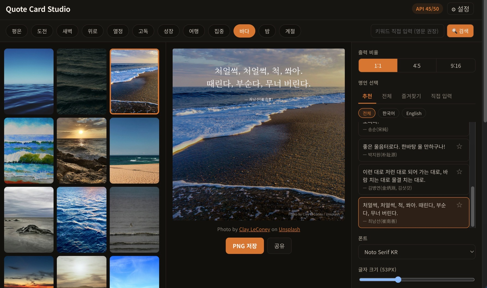

# Quote Card Studio



Unsplash 사진 + 명언을 합성해 인스타그램 규격(1:1, 4:5, 9:16) PNG 카드를 만드는 브라우저 전용 웹앱입니다. 서버 없이 `localStorage`만으로 동작합니다.

## 로컬 실행

```bash
npm install
cp .env.example .env.local   # (선택) 개발용 Unsplash Access Key 입력
npm run dev                  # http://localhost:5173
```

Unsplash Access Key는 https://unsplash.com/oauth/applications 에서 앱을 등록하면 발급받을 수 있습니다 (Demo 모드: 시간당 50회).

키는 앱 실행 후 우측 상단 **⚙ 설정**에서 직접 입력해도 되고(BYOK, 브라우저에만 저장됨), 로컬 개발 중에는 `.env.local`의 `VITE_UNSPLASH_ACCESS_KEY`가 기본값으로 사용됩니다(개발 모드 한정).

## 빌드 / 배포

```bash
npm run build      # dist/ 생성
npm run preview    # 빌드 결과 로컬 미리보기
```

GitHub Pages 배포:

1. `vite.config.js`의 `base`가 저장소 이름과 동일한지 확인합니다 (현재 `/goorm-260930-unsplash-quote-insta/`).
2. 저장소 **Settings → Pages → Source**를 **GitHub Actions**로 설정합니다.
3. `main` 브랜치에 push하면 `.github/workflows/deploy.yml`이 자동 빌드·배포합니다.

API 키는 BYOK 방식이므로 워크플로/저장소 시크릿에 넣을 필요가 없습니다.

Vercel 배포:

```bash
vercel        # 프리뷰 배포 (최초 실행 시 프로젝트 연결)
vercel --prod # 프로덕션 배포
```

Vercel은 Vite 프로젝트를 자동으로 인식해 `npm run build` → `dist/`를 배포합니다. `vite.config.js`의 `base`는 Vercel 빌드 환경에서 자동으로 `/`로 설정되므로 별도 설정이 필요 없습니다. 이 프로젝트도 마찬가지로 BYOK 방식이라 Vercel 환경 변수를 추가할 필요가 없습니다.

## 폴더 구조

```
src/
├── context/     # SettingsContext, EditorContext
├── services/    # unsplash.js, apiKey.js, storage.js
├── hooks/       # useUnsplashSearch, useLocalStorage, useCardRenderer, useRateLimit
├── utils/       # color, loadImage, drawCover, wrapText, renderCard, attribution, exportCard
├── data/        # moods.js, quotes.json, presets.js
└── components/  # UI 컴포넌트
```

자세한 기술 명세는 [`xref/D03 SPEC quote-card-studio-tech-spec.md`](xref/D03%20SPEC%20quote-card-studio-tech-spec.md)를 참고하세요.

## 작업 내역

### 최신 변경 사항

- **명언 데이터 교체**: 가을 한/중/일 고전 20편 → 최종적으로 **한국문학 명언 50편**(「공무도하가」~김소월·한용운·정지용 등 근대시)으로 `src/data/quotes.json` 전체 교체. 원문(한자/고어)·독음·출처·시대 메타데이터(`original`, `reading`, `source`, `era`)도 함께 보존.
- **파비콘 적용**: 제공된 16×16 PNG(`xref/D03 favicon-16.png`)를 `public/favicon.png`로 반영하고 `index.html`의 favicon 링크를 SVG에서 PNG로 교체. 기존 Vite 기본 SVG 파비콘은 삭제.
- **Vercel 배포 지원**: `vite.config.js`의 `base`를 배포 환경에 따라 분기(Vercel은 `/`, GitHub Pages는 저장소 서브패스)하도록 수정. 값이 고정돼 있던 이전 상태 그대로 Vercel에 배포했다면 정적 자산(JS/CSS)이 404났을 것을 사전에 방지.
- 데이터 교체 2회 모두 JSON 유효성·빌드·린트·실제 화면 렌더링을 자동 테스트로 검증(문제 없음).

### 초기 구현

- 명세(`xref/D03 SPEC`)의 폴더 구조·데이터 흐름을 그대로 따라 Vite 6→8 + React 19 프로젝트를 처음부터 스캐폴딩
- Unsplash 검색(`/search/photos`) · 랜덤(`/photos/random`) · 다운로드 트래킹(`/photos/:id/download`) 연동, `Client-ID` 인증, Rate limit 헤더 추적, 요청 캐시
- BYOK 방식 API 키 관리(`localStorage`, 개발 모드에서만 `.env.local` 기본값 사용)
- Canvas 합성 파이프라인: `crossOrigin="anonymous"` 이미지 로딩, cover 크롭, 한/영 혼합 줄바꿈, WCAG 상대 휘도 기반 자동 텍스트색·오버레이, 폰트 로딩 대기 후 렌더링
- PNG 내보내기(1080×H, 다운로드 트래킹 호출 후 저장) + 모바일 Web Share API 공유
- 분위기 칩 12종, 명언 피커(추천/전체/즐겨찾기/직접 입력, 언어 필터), 에디터 패널(폰트·크기·정렬·위치·오버레이), 프리셋 3종, 최근 작업 20개
- 데스크톱 3열 레이아웃 / 모바일 사진·편집·내보내기 3탭 반응형 UI
- 실제 Unsplash Access Key로 검색 → 사진 선택 → 명언 선택 → PNG 저장까지 전체 플로우 e2e 검증(Playwright), 1080×1350 등 규격 픽셀 크기 확인
- 사진 검색 결과 노출 방식을 무한 스크롤에서 **12장 표시 + "이미지 더 보기" 버튼** 클릭식 페이지네이션으로 변경

### 오류 수정 이력

- **GitHub Pages `base` 불일치**: `vite.config.js`의 `base`가 임시값(`/quote-card-studio/`)으로 되어 있어 실제 저장소 이름과 달랐던 문제를 수정. 방치했다면 배포 후 자산(JS/CSS) 404가 발생했을 것.
- **페이지네이션 리셋 시 린트 경고**: 새 검색 시작 시 노출 개수를 12장으로 리셋하는 로직을 `useEffect` 기반에서 렌더링 중 상태 비교 방식으로 바꿔 `oxlint`의 `set-state-in-effect` 경고와 불필요한 추가 리렌더링을 제거.
- **개발 중 HMR 훅 순서 오류**: `useUnsplashSearch`에 상태를 추가하는 과정에서 Vite 핫리로드가 일시적으로 "Should have a queue" React 오류를 발생시켰음을 dev 서버 로그에서 확인. 코드 자체 결함이 아니라 HMR 특성으로, 브라우저 새로고침으로 해소됨을 확인.
- **사진 작가 크레딧 노출 검증**: 사진만 선택된 상태/사진+명언 선택 후 렌더링된 카드 내부(우하단, PNG에 포함) 및 미리보기 하단(클릭 가능한 링크) 양쪽 모두에서 작가명·Unsplash 출처가 정상 노출되는 것을 확인.
- `oxlint` 미사용 변수(unsplash.js catch 파라미터), `useMemo` 의존성 배열 경고 정리.

## 참고

- `src/data/quotes.json`은 현재 한국문학 명언 50편(전부 한국어)으로 채워져 있어 명언 피커의 "English" 언어 필터는 비어 있습니다. 영문 명언이 필요하면 직접 입력 탭을 사용하거나 데이터를 보충하세요.
- 이미지를 합성해 PNG로 내보낼 때마다 Unsplash 다운로드 트래킹 API를 호출합니다(가이드라인 준수).
